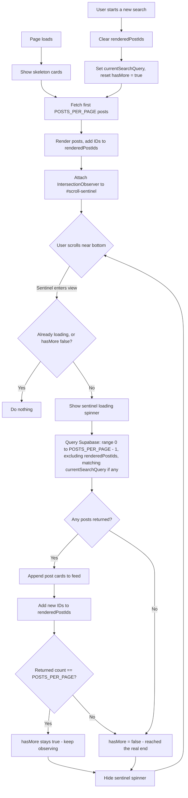

# Feed Pagination & Scroll-Loading Indicator — Plan

## The Problem (As Reported)
- The feed only shows a limited number of posts and doesn't keep loading older posts as the user scrolls down.
- There's no clear loading indicator shown while more posts are being fetched during scroll.

## Root Cause
`fetchPosts()` in `feed.html` was combining two pagination strategies at once:

1. **Offset pagination** — `.range(from, to)` where `from = currentPage * POSTS_PER_PAGE`.
2. **Exclusion pagination** — `.not('id', 'in', renderedPostIds)`, filtering out posts already shown.

Doing both together means the offset skips ahead *inside a dataset that's already had posts removed from it*. Once total post count is small (fewer than roughly 2x the page size), this produces an empty result — so scrolling further does nothing, even though older posts genuinely exist in the database. That's the "limited past posts" symptom.

Separately, the scroll observer checked the desktop search bar directly and refused to fetch anything at all while it had text in it, so search results never paginated either.

**Status: this has already been fixed in `feed.html`** (see `Infinite_Scroll_Pagination_Fix_Plan.md` for the full write-up). This document formalizes the plan and the loading-indicator behavior specifically, as its own reference.

## The Fix

### 1. Pagination — rely only on exclusion, not offset + exclusion together
- Every fetch now queries `range(0, POSTS_PER_PAGE - 1)`.
- `renderedPostIds` (a `Set` of every post ID already shown) is passed as a `.not('id', 'in', ...)` filter, so each fetch naturally returns "the next batch I haven't seen," regardless of how many posts have been removed/excluded already.
- `hasMore` is set to `false` once a fetch returns fewer posts than `POSTS_PER_PAGE` — that's the real end of the feed, not an artifact of bad math.

### 2. Loading indicator during scroll
There are two loading states, both already wired to the DOM:

| State | Element | Behavior |
|---|---|---|
| Initial page load | Skeleton post cards (`createPostSkeleton()`) | Shown in place of the feed while the very first batch loads |
| Scrolling for more | `#scroll-sentinel` spinner icon | `opacity-0` is removed while a fetch is in flight, then re-added once it resolves |

The sentinel element sits at the bottom of the feed and is watched by an `IntersectionObserver`. When it scrolls into view (`rootMargin: '200px'`, so it triggers slightly before the user hits the literal bottom), that's the load-more trigger.

### 3. Search integration
- A `currentSearchQuery` variable tracks whatever search term is active (if any).
- The same observer always calls `fetchPosts(currentSearchQuery)` — it no longer blocks itself out during an active search.
- Starting a new search clears `renderedPostIds` so previously-seen posts aren't wrongly excluded from matching search results.

## Flowchart

## Verification Plan
- [ ] Scroll down on an account with a small number of total posts (fewer than ~10) — confirm the feed doesn't stall early and keeps loading until the real end.
- [ ] Watch the sentinel spinner specifically — it should appear right before each new batch loads and disappear once posts are appended, not stay hidden the whole time.
- [ ] Search for a keyword, then scroll down — confirm older matching posts keep loading instead of stopping after the first batch.
- [ ] Confirm a post you'd already seen in the normal feed can still show up in search results if it matches the term.
- [ ] Scroll all the way to the true end of the feed — confirm the spinner stops appearing and no further (empty) requests keep firing.