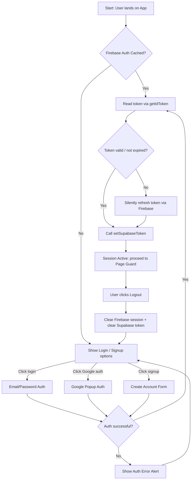
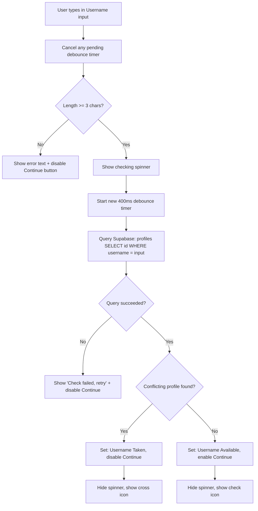
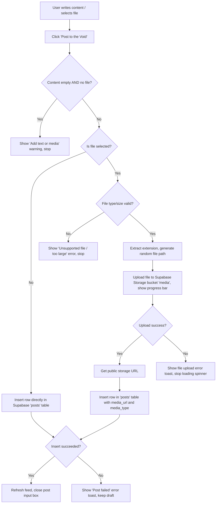
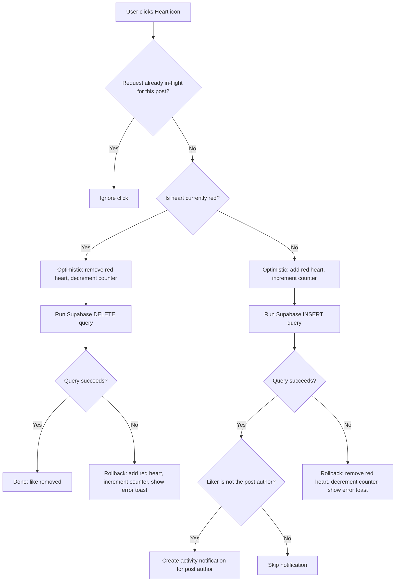
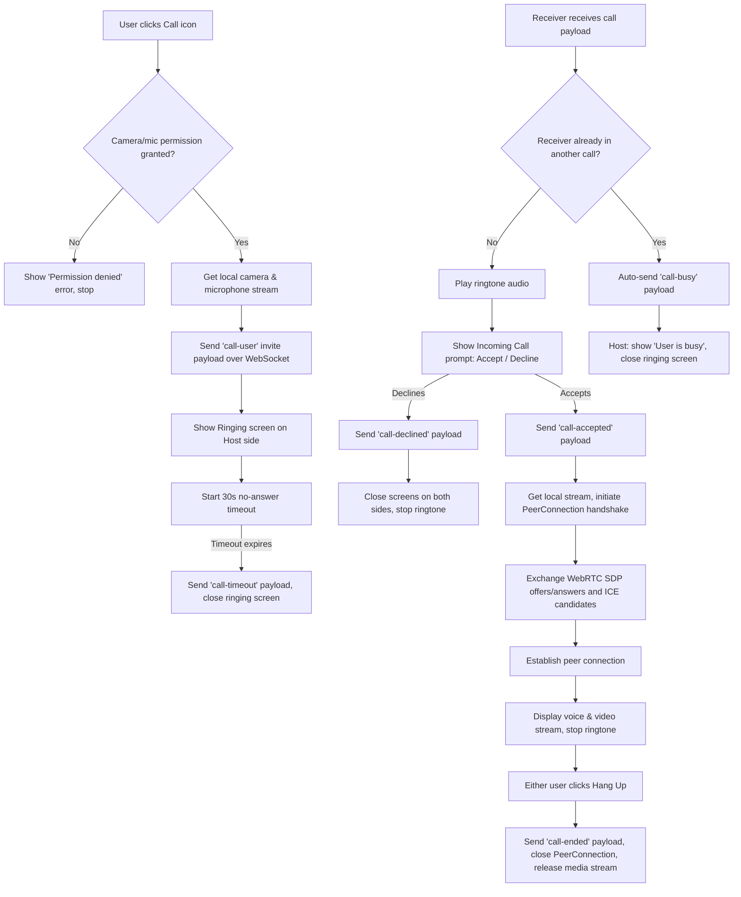
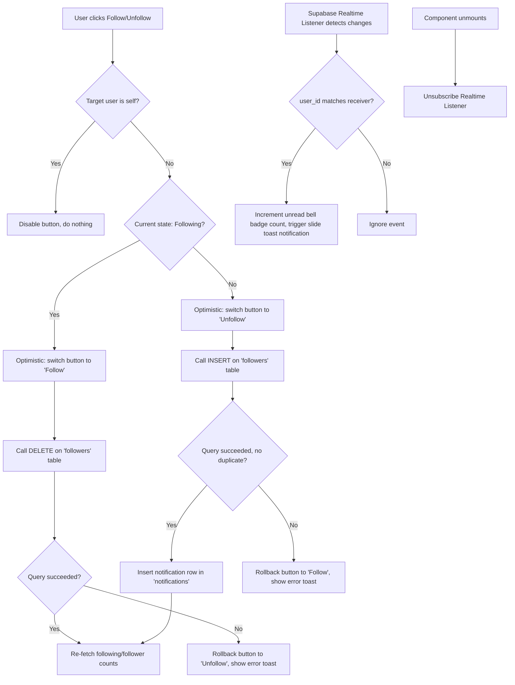

# Feature-by-Feature Flowcharts (Corrected & Improved)

This document breaks down the NotWorking application into individual flowcharts for each feature and function.

Each section below has been reviewed for syntax issues and missing edge cases. A short "What changed" note follows every diagram.

---

## 1. Authentication & Session Flow

**What changed:**
- The hyphenated label `Session Active - Go to Page Guard` was wrapped in quotes so Mermaid doesn't misparse the dash as part of a link. Reworded for clarity.
- Added a token-expiry check (`C1`) with a silent-refresh branch — the original assumed a cached token is always valid.
- The auth-error path (`J`) previously dead-ended. It now loops back to the login screen instead of leaving the user stuck.
- Added a Signup branch (the node existed as a label but had no actual flow).
- Added a Logout flow, which was missing entirely.

---

## 2. Profile Builder & Real-time Username Validator

**What changed:**
- Added debounce cancellation (`A1`) on every keystroke — without it, rapid typing fires overlapping timers/queries that can resolve out of order and show a stale result.
- Added a network/query-failure branch (`F1`); the original assumed the Supabase call always succeeds.

---

## 3. Post Creation & Media Upload Flow

**What changed:**
- Added a guard against submitting an empty post (`B1`) — the original let a blank/no-file post reach the database.
- Added client-side file validation (`C1`) before upload, avoiding wasted storage calls on oversized or unsupported files.
- Added an upload progress indicator note on the storage step.
- Added a failure branch on the `posts` table insert (`K`) — previously any DB error here was unhandled and would silently drop the post.

---

## 4. Post Liking with Optimistic Rollbacks

**What changed:**
- Added an in-flight request guard (`A0`) to prevent rapid double-clicks from racing two optimistic updates against each other.
- Added a self-like check (`K`) so users don't get a notification for liking their own post.

---

## 5. WebSocket Real-time Voice and Video Call Flow

**What changed:**
- Added a permission-check branch (`A1`) — the original assumed `getUserMedia` always succeeds.
- Added a "receiver busy" path (`E1`/`E2`) — without it, a second incoming call while already on one would just show a confusing double prompt.
- Added a no-answer timeout (`D1`) so the caller isn't stuck on the ringing screen forever if the receiver never responds.
- Added a hang-up / call-end flow (`O`/`P`) — the original diagram never closed the connection or released the camera/mic after a call.

---

## 6. Social Follower & Notification System

**What changed:**
- Added a self-follow guard (`A1`) — nothing stopped a user from following themselves in the original.
- Added query-result checks (`D1`, `G1`) with rollback on failure — the original had no optimistic-rollback safety net here, unlike the liking flow, so a failed insert/delete would leave the UI out of sync with the database.
- Added a duplicate-follow guard via the unique-constraint check in `G1`.
- Added listener cleanup (`M`/`N`) on component unmount — without unsubscribing, the Realtime listener leaks and can fire duplicate notifications after remount.

---

## Summary of Cross-Cutting Gaps Found

| Area | Issue in original | Fix applied |
|---|---|---|
| Auth | No token refresh, no logout, dead-end on error | Added refresh, logout, retry loop |
| Profile builder | No debounce cancellation, no network-failure case | Added both |
| Post creation | No empty-post guard, no file validation, no insert-failure handling | Added all three |
| Liking | No double-click guard, notifies on self-like | Added guard + self-check |
| Calling | No permission check, no busy state, no timeout, no hang-up | Added all four |
| Follow system | No self-follow guard, no rollback on failure, no listener cleanup | Added all three |
