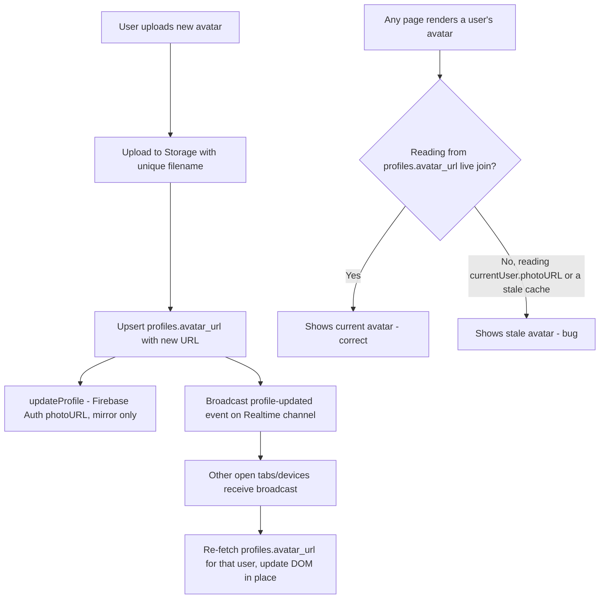

# Stale Avatar Bug — Old Profile Photo Still Showing in Past Posts & Messages

## Symptom
User changes their profile photo. The new photo shows correctly in some places, but old posts and DM conversations keep showing the **old** photo instead of picking up the change.

## Why This Confused the Trail: It's Probably NOT a Single Bug
Two different root causes produce the exact same symptom, and they need different fixes. Before writing any code, **run the diagnostic below** — it tells you which one you actually have in ~2 minutes, instead of guessing.

---

## Diagnostic (Do This First)

1. Change your avatar and save.
2. Open DevTools → Network tab (filter: Img).
3. Open a page with an old post (or an old message) from before the change.
4. Look at the actual image **request URL** the browser sent for that old post's avatar.

**Case A — the request URL is the NEW avatar file, but it looks stale anyway** → this is a client-side caching problem (Firebase Auth session state, or a profile cache inside `shared/ui.js`). The correct data is being fetched, something in your JS is just not using it.

**Case B — the request URL is still the OLD avatar file** → this means the old post/message/comment has the old URL baked into it somehow, not fetched live. This is a data/query problem, not a caching problem.

Confirmed from the code reviewed so far: `uploadAvatarFile()` in `profile.html` generates a genuinely unique filename per upload (`avatar-${Date.now()}.${ext}`), and the save handler correctly `upsert()`s the new URL into `profiles.avatar_url`. So **Case B should not be architecturally possible for posts/comments**, since `feed.html`/`profile.html` fetch posts with a live join:
```js
supabase.from("posts").select(`*, likes(count), comments(count), profiles(username, full_name, avatar_url)`)
```
That `profiles(...)` is a live join executed at query time — it always pulls whatever is currently in the `profiles` table, not a stored copy. **If Case B is what you're actually seeing on posts/comments specifically, something is overriding that join result** — see Cause 3 below.

Messages haven't been fully re-confirmed here — if chat messages store the sender's avatar directly on the `messages` row instead of joining `profiles` live, Case B is architecturally expected there and needs a schema-level fix (Cause 4).

---

## Cause 1 (Most Likely) — Firebase Auth's `photoURL` is stale in already-open tabs
`updateProfile(currentUser, { photoURL: avatarUrl })` updates the Firebase Auth user object **only in the browser tab where the change was made**, and only for the rest of that tab's session. Any other already-open tab (or the same tab if it doesn't fully reload some other flow) is holding an older in-memory `currentUser` object from whenever `onAuthStateChanged`/`onIdTokenChanged` last fired. If any part of the UI displays "your own" avatar from `currentUser.photoURL` instead of from `profiles.avatar_url`, that spot will show the old photo until the tab reloads or the ID token refreshes.

**Fix:** audit every place `currentUser.photoURL` is read for display purposes, and replace it with the value from the `profiles` table fetch instead. `currentUser.photoURL` should only ever be treated as a Firebase-side mirror, never the source of truth for rendering.

## Cause 2 — A client-side profile cache inside `shared/ui.js` isn't invalidated
If post/comment rendering avoids an N+1 query problem by caching author profiles in memory (e.g. a `Map` keyed by user id, populated once per session), that's good practice for performance — but if it's never invalidated, a user who changes their avatar will keep seeing their **own** stale cached entry reused for every post render for the rest of that session, even though the live join in the query itself returned the correct new URL underneath it.

**Fix:** any such cache needs either (a) a short TTL, or (b) an explicit invalidation call the moment a profile is saved — e.g. `profileCache.delete(currentUser.uid)` right after the `upsert()` in `profile.html`'s save handler succeeds.

*(This file hasn't been shared yet — flag this as "needs verification against the actual `shared/ui.js` contents" rather than a confirmed cause.)*

## Cause 3 — `createPostElement()` renders avatar from the wrong field
Worth double-checking directly: does `createPostElement()` (in `shared/ui.js`) read `post.profiles.avatar_url` (live, correct) or something else entirely, like a value passed in separately from `currentUser` at render time? If the "is this my own post" branch takes a shortcut and uses the locally cached current-user object instead of the row's own joined `profiles` data, that would explain stale avatars specifically on **your own** past posts while other users' posts update fine.

## Cause 4 — Messages may denormalize sender avatar per-message (schema-level, if true)
If the `messages` table stores `sender_avatar_url` directly on each row (a common performance pattern for chat, since joining `profiles` on every single message in a long thread is expensive), then every message ever sent has the avatar **frozen at the moment it was sent** — that's not really a bug, it's how the schema was designed, but it means "change once, update everywhere" was never actually implemented for messages.

**Fix, if this is confirmed:** either (a) stop denormalizing and join `profiles` live on message fetch (simplest, costs a bit of query performance on long threads), or (b) keep the denormalized column for performance, but explicitly re-render using the sender's current profile fetched separately for **display only**, keeping the stored value as a fallback/cache rather than the display source of truth.

---

## Recommended Fix Plan (In Order)

1. **Run the diagnostic above first.** Don't fix anything until you know whether you're dealing with Case A or Case B — they need different code changes.
2. If Case A (stale-in-tab): audit every read of `currentUser.photoURL` across all five pages and replace display-purpose reads with the `profiles.avatar_url` value fetched from Supabase.
3. If there's a profile cache in `shared/ui.js`: add explicit invalidation on save, in `profile.html`'s submit handler, immediately after the `upsert()` succeeds.
4. Confirm what `createPostElement()` actually does with the avatar field — share `shared/ui.js` so this can be checked directly instead of inferred.
5. If Case B is confirmed for messages specifically: decide between live-join (simpler, correct-by-construction) vs. denormalized-with-explicit-refresh (faster, more moving parts) based on how large your message threads typically get. For your current scale, live-join is almost certainly the simpler and more correct choice.
6. **Bonus fix while you're in here:** after a successful avatar save, broadcast the change on a Supabase Realtime channel (`profile-updates` or similar) so *other already-open tabs/devices* (not just the one that made the change) pick up the new avatar without needing a manual reload — this is the difference between "works after I refresh" and "actually updates everywhere immediately," which is what you originally asked for.

## The Right Long-Term Pattern
`profiles.avatar_url` should be the **single source of truth**, always fetched live, never denormalized onto other tables and never read from a cached Firebase Auth object for display. Anywhere that's not currently true is where this bug is hiding.



## Related Fix (Implemented): Old Avatar File Wasn't Deleted From Storage

**Separate from the display bug above, but connected**: every avatar upload gets a unique filename (`avatar-${Date.now()}.${ext}`), which is correct for making sure old and new URLs never collide — but it also means every avatar change leaves the **old** file sitting in the Supabase Storage bucket forever, since nothing ever deleted it. Over time this is pure wasted storage: an account that changes its avatar 20 times has 20 files in Storage for one visible photo.

**Fix (implemented in `profile.html`):**
1. Before uploading a new avatar, the current `avatar_url` is captured (`previousAvatarUrl`).
2. The new avatar uploads and the profile save (`upsert`) happens as before.
3. **Only after the database save succeeds**, the old file is deleted from Storage via `supabase.storage.from('media').remove([path])`.
4. If deletion fails for some reason, it's logged as a non-fatal warning — it doesn't block the save the user is actually waiting on. Worst case is one orphaned file, which is the same situation as before this fix, not worse.
5. Path parsing is done defensively: it only attempts deletion for URLs that match the actual Supabase Storage public-URL shape (`.../media/...`). A placeholder/default avatar path won't match this, so it's safely skipped rather than causing an error trying to delete something that was never actually uploaded.

**Why cleanup happens *after* the DB save, not before/instead:** if the old file were deleted first and the database save then failed for any reason (network blip, validation error), the user would be left with no avatar file at all — worse than the original orphaned-file problem. Deleting only after a confirmed successful save means the failure mode is always "one extra orphaned file," never "no avatar."

**Note:** this cleans up storage going forward. It does **not** retroactively delete files from *before* this fix was added — those old orphaned avatar files (if any exist from testing) would need a one-time manual cleanup pass (e.g. a small script comparing everything in the `avatars/` Storage path against the current `profiles.avatar_url` values and removing anything not referenced) if reclaiming that space matters.

## Verification Plan
- [ ] Run the diagnostic (Network tab check) before and after any fix — confirm which Case you actually had.
- [ ] Change avatar, then without reloading, check: does a *different already-open tab* (or a second browser) showing the same user's old posts update its avatar automatically, or only after a manual refresh? (Tests the Realtime-broadcast bonus fix.)
- [ ] Scroll through old posts and old messages from before the avatar change — confirm the new photo appears everywhere, not just on new content going forward.
- [ ] Check another user viewing your profile/posts (not just your own session) — confirms this isn't only fixed for the account that made the change.
- [ ] Change your avatar, then check the Supabase Storage dashboard under `avatars/<your-uid>/` — confirm only the current file remains and the previous one is gone (tests the new cleanup fix).
- [ ] Change your avatar twice in a row quickly — confirm both saves succeed and only the most recent file remains (no race condition between the two uploads/deletes).